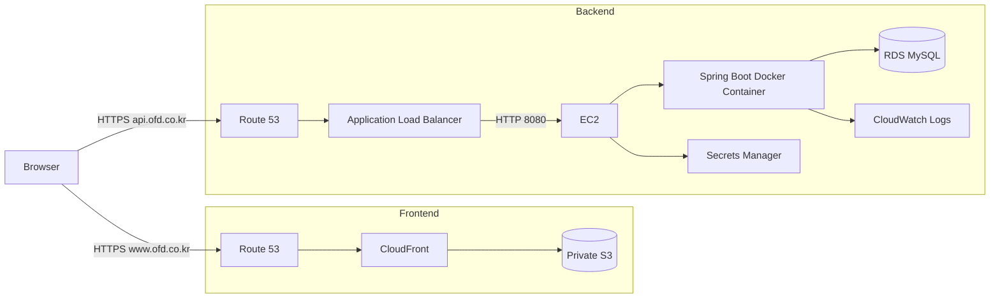
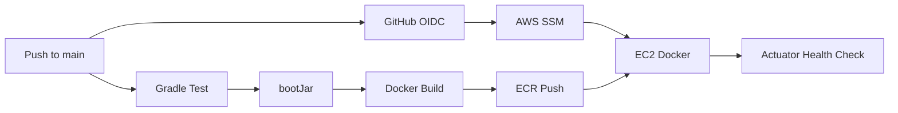

# Inventory Management System - Backend

물류센터의 상품, 창고, 재고를 관리하는 WMS(Warehouse Management System) 백엔드 프로젝트입니다.

단순 CRUD 구현을 넘어서 실제 재고 시스템에서 중요한 **재고 정합성, 동시성 제어, 트랜잭션 롤백, 데드락 위험 감소, DB Migration, CI/CD와 AWS 배포**를 중심으로 구현했습니다.

## Live Service

- Frontend: https://www.ofd.co.kr
- API Base URL: https://api.ofd.co.kr
- Frontend Repository: https://github.com/robin12303/inventory-management-frontend

---

## 주요 기능

### 상품 관리

- 상품 등록
- 상품 전체 / 단건 조회
- 상품 수정
- 상품 삭제
- SKU 중복 검증

### 창고 관리

- 창고 등록
- 창고 전체 / 단건 조회
- 창고 수정
- 창고 삭제
- 창고 코드 중복 검증

### 재고 관리

- 상품 입고
- 상품 출고
- 창고별 현재 재고 조회
- 창고 간 재고 이동
- 재고 부족 검증
- 재고 변경 이력 저장

### 재고 이력

- 입고 이력
- 출고 이력
- 창고 이동 입고 / 출고 이력
- 상품별 필터링
- 창고별 필터링
- Pagination

---

## Tech Stack

### Backend

- Java 17
- Spring Boot 4
- Spring MVC
- Spring Data JPA
- Hibernate
- Bean Validation
- Spring Boot Actuator
- Gradle

### Database

- MySQL
- Amazon RDS for MySQL
- Flyway

### Test

- JUnit 5
- AssertJ
- Mockito
- Testcontainers
- MySQL Container

### Infrastructure

- AWS EC2
- AWS Application Load Balancer
- AWS RDS
- AWS ECR
- AWS Route 53
- AWS Certificate Manager
- AWS Secrets Manager
- AWS Systems Manager
- AWS CloudWatch Logs
- AWS IAM
- GitHub OIDC
- Docker

### CI/CD

- GitHub Actions
- Docker
- Amazon ECR
- AWS Systems Manager

---

## System Architecture



운영 환경에서는 EC2의 애플리케이션 포트를 인터넷에 직접 공개하지 않고,
ALB를 통해서만 접근하도록 Security Group을 구성했습니다.

RDS 또한 외부 인터넷에 직접 공개하지 않고 애플리케이션 서버에서만 접근하도록 구성했습니다.

---

# 핵심 설계

## 1. 비관적 락을 이용한 재고 정합성 제어

재고 시스템에서는 동일 상품에 대한 여러 요청이 동시에 들어올 수 있습니다.

예를 들어 재고가 10개인 상태에서 두 개의 출고 요청이 동시에 현재 재고를 조회하고 각각 8개를 출고한다면,
동시성 제어가 없을 경우 실제 보유 수량보다 많은 상품이 출고되는 문제가 발생할 수 있습니다.

이를 방지하기 위해 출고 시 재고 행을 조회할 때 `PESSIMISTIC_WRITE` Lock을 사용했습니다.

```java
@Lock(LockModeType.PESSIMISTIC_WRITE)
@Query("""
    select i
    from Inventory i
    where i.warehouse.id = :warehouseId
      and i.product.id = :productId
    """)
Optional<Inventory> findByWarehouseIdAndProductIdForUpdate(
        Long warehouseId,
        Long productId
);
```

처리 순서는 다음과 같습니다.

```text
재고 Row Lock 획득
        ↓
현재 재고 확인
        ↓
출고 가능 수량 검증
        ↓
재고 차감
        ↓
이력 저장
        ↓
Transaction Commit
```

재고가 부족하면 변경을 수행하지 않고 `InsufficientStockException`을 발생시킵니다.

---

## 2. 창고 이동의 데드락 위험 감소

창고 이동은 출발 창고와 도착 창고의 두 재고 행을 동시에 수정해야 합니다.

다음 두 요청이 동시에 들어온다고 가정할 수 있습니다.

```text
Transaction A
Warehouse 1 → Warehouse 2

Transaction B
Warehouse 2 → Warehouse 1
```

각 트랜잭션이 서로 다른 순서로 Lock을 획득하면 다음 상황이 가능합니다.

```text
A: Warehouse 1 Lock 획득
B: Warehouse 2 Lock 획득

A: Warehouse 2 대기
B: Warehouse 1 대기
```

이를 줄이기 위해 요청 방향과 관계없이 **Warehouse ID가 작은 재고부터 항상 먼저 Lock을 획득**하도록 순서를 고정했습니다.

```java
Long firstWarehouseId =
        Math.min(
                request.fromWarehouseId(),
                request.toWarehouseId()
        );

Long secondWarehouseId =
        Math.max(
                request.fromWarehouseId(),
                request.toWarehouseId()
        );
```

따라서 다음 두 요청 모두:

```text
1 → 2
2 → 1
```

Lock 획득 순서는:

```text
Warehouse 1
    ↓
Warehouse 2
```

로 동일합니다.

이를 통해 서로 반대 방향의 재고 이동 요청에서도 Lock Ordering을 일관되게 유지합니다.

---

## 3. 목적지 재고가 없는 경우 처리

창고 이동 시 도착 창고에 해당 상품의 Inventory Row가 아직 존재하지 않을 수도 있습니다.

이 경우 먼저 수량이 0인 재고 Row를 생성하되 이미 존재한다면 아무 변경도 하지 않는 방식으로 초기화합니다.

```sql
INSERT INTO inventory (
    warehouse_id,
    product_id,
    quantity
)
VALUES (
    :warehouseId,
    :productId,
    0
)
ON DUPLICATE KEY UPDATE
    quantity = quantity;
```

그 후 출발지와 도착지 Inventory Row에 대해 Lock을 획득합니다.

이 방식으로 목적지에 기존 재고가 없는 경우에도 동일한 재고 이동 로직을 적용할 수 있도록 구성했습니다.

---

## 4. 입고 시 Atomic Upsert

입고는 MySQL의 `INSERT ... ON DUPLICATE KEY UPDATE`를 사용합니다.

```sql
INSERT INTO inventory (
    warehouse_id,
    product_id,
    quantity
)
VALUES (
    :warehouseId,
    :productId,
    :quantity
)
ON DUPLICATE KEY UPDATE
    quantity = quantity + :quantity;
```

재고 Row가 존재하지 않으면 생성하고,
이미 존재한다면 기존 수량에 입고 수량을 더합니다.

애플리케이션에서 조회 → 분기 → UPDATE를 별도로 수행하는 대신 DB의 원자적 연산을 사용했습니다.

---

## 5. 재고 변경과 이력 저장의 트랜잭션 처리

입고, 출고, 창고 이동은 `@Transactional` 범위에서 처리합니다.

창고 이동에서는:

```text
출발 창고 재고 감소
        +
도착 창고 재고 증가
        +
TRANSFER_OUT 이력
        +
TRANSFER_IN 이력
```

을 하나의 트랜잭션으로 처리합니다.

중간에 예외가 발생하면 일부 변경만 DB에 남는 것이 아니라 전체 작업이 Rollback 되어야 합니다.

Testcontainers 통합 테스트에서는 두 번째 이력 저장 시 강제로 예외를 발생시켜,
재고가 이동 전 상태로 Rollback 되는 것을 검증했습니다.

```text
이동 전
Warehouse A = 100
Warehouse B = 0

30개 이동 시도
        ↓
이력 저장 과정에서 예외 발생
        ↓
Transaction Rollback

최종
Warehouse A = 100
Warehouse B = 0
```

---

## 6. 재고 이동 이력

모든 재고 변경은 `stock_history`에 기록합니다.

지원하는 Movement Type은 다음과 같습니다.

```text
INBOUND
OUTBOUND
TRANSFER_IN
TRANSFER_OUT
```

창고 A에서 창고 B로 30개를 이동하면 두 개의 이력이 생성됩니다.

```text
Warehouse A
TRANSFER_OUT 30
Related Warehouse = B

Warehouse B
TRANSFER_IN 30
Related Warehouse = A
```

이를 통해 단순히 현재 재고 수량뿐 아니라 재고가 어떤 이유로 변경되었는지도 추적할 수 있습니다.

---

## 7. Flyway 기반 Schema Migration

Hibernate가 운영 DB Schema를 자동으로 변경하도록 하지 않고 Flyway를 사용해 Schema 변경 이력을 관리합니다.

현재 Migration:

```text
V1__create_product_table.sql
V2__create_warehouse_table.sql
V3__create_inventory_table.sql
V4__create_stock_history_table.sql
```

JPA 설정은 다음과 같습니다.

```yaml
spring:
  jpa:
    hibernate:
      ddl-auto: validate
```

즉 애플리케이션 시작 시 Entity와 DB Schema가 일치하는지는 검증하지만,
Hibernate가 임의로 운영 DB Schema를 생성하거나 수정하지는 않습니다.

---

# API

## Product

| Method | Endpoint | Description |
|---|---|---|
| POST | `/products` | 상품 등록 |
| GET | `/products` | 상품 전체 조회 |
| GET | `/products/{id}` | 상품 단건 조회 |
| PUT | `/products/{id}` | 상품 수정 |
| DELETE | `/products/{id}` | 상품 삭제 |

## Warehouse

| Method | Endpoint | Description |
|---|---|---|
| POST | `/warehouses` | 창고 등록 |
| GET | `/warehouses` | 창고 전체 조회 |
| GET | `/warehouses/{id}` | 창고 단건 조회 |
| PUT | `/warehouses/{id}` | 창고 수정 |
| DELETE | `/warehouses/{id}` | 창고 삭제 |

## Inventory

| Method | Endpoint | Description |
|---|---|---|
| GET | `/inventories` | 현재 재고 조회 |
| POST | `/inventories/inbound` | 입고 |
| POST | `/inventories/outbound` | 출고 |
| POST | `/inventories/transfer` | 창고 간 이동 |

## Stock History

| Method | Endpoint | Description |
|---|---|---|
| GET | `/stock-histories` | 재고 이력 조회 |

Query Parameters:

```text
warehouseId : 창고 필터 (optional)
productId   : 상품 필터 (optional)
page        : 페이지 번호, default 0
size        : 페이지 크기, default 20, max 100
```

---

# Request Example

## 입고

```http
POST /inventories/inbound
Content-Type: application/json
```

```json
{
  "warehouseId": 1,
  "productId": 1,
  "quantity": 100
}
```

## 출고

```http
POST /inventories/outbound
Content-Type: application/json
```

```json
{
  "warehouseId": 1,
  "productId": 1,
  "quantity": 20
}
```

## 창고 이동

```http
POST /inventories/transfer
Content-Type: application/json
```

```json
{
  "fromWarehouseId": 1,
  "toWarehouseId": 2,
  "productId": 1,
  "quantity": 30
}
```

---

# Testing

실제 MySQL과 유사한 환경에서 검증하기 위해 Testcontainers를 사용했습니다.

주요 통합 테스트:

### 목적지 재고 미존재 이동

```text
출발 재고 = 100
도착 재고 Row = 없음

30개 이동
        ↓
출발 = 70
도착 = 30
        ↓
TRANSFER_OUT / TRANSFER_IN 이력 생성
```

### 반대 방향 동시 이동

두 개의 스레드에서 동시에:

```text
Warehouse 1 → Warehouse 2 : 30
Warehouse 2 → Warehouse 1 : 30
```

을 수행합니다.

테스트에서는 두 작업이 지정 시간 내 정상 종료되고 최종 재고가:

```text
Warehouse 1 = 100
Warehouse 2 = 100
```

으로 유지되는지 검증합니다.

### Transaction Rollback

이력 저장 과정에서 의도적으로 예외를 발생시켜
재고 변경까지 함께 Rollback 되는지 검증합니다.

테스트 실행:

```bash
./gradlew test
```

---

# CI/CD

`main` 브랜치에 Push되면 GitHub Actions가 자동으로 Backend를 빌드하고 AWS에 배포합니다.



배포 과정:

```text
git push main
        ↓
GitHub Actions
        ↓
./gradlew clean test bootJar
        ↓
Docker Image Build
        ↓
Commit SHA + latest Tag
        ↓
Amazon ECR Push
        ↓
GitHub OIDC로 AWS Role Assume
        ↓
AWS SSM SendCommand
        ↓
EC2에서 Docker Image Pull
        ↓
새 Container 실행
        ↓
/actuator/health 확인
```

GitHub 저장소에 장기 AWS Access Key를 저장하지 않고
GitHub OIDC를 이용해 필요한 IAM Role을 Assume하도록 구성했습니다.

---

# Secret Management

운영 DB 접속 정보는 소스 코드 또는 GitHub Actions에 직접 저장하지 않습니다.

EC2가 AWS Secrets Manager에서 DB 정보를 가져와 Docker Container의 환경 변수로 전달합니다.

```text
AWS Secrets Manager
        ↓
EC2 IAM Role
        ↓
DB Host / Port / Username / Password
        ↓
Spring Boot Container
        ↓
RDS MySQL
```

---

# Logging & Health Check

Spring Boot Actuator의 Health Endpoint를 배포 검증에 사용합니다.

```text
GET /actuator/health
```

GitHub Actions 배포 과정에서는 애플리케이션 시작 후 Health Endpoint를 반복 확인하며,
정상 상태가 확인되어야 배포 작업이 성공합니다.

Docker Application Log는 AWS CloudWatch Logs로 전송하도록 구성했습니다.

---

# Local Development

## Docker Compose

Docker와 Docker Compose가 설치되어 있다면:

```bash
docker compose up --build
```

실행 후:

```text
Application
http://localhost:8080

MySQL
Docker internal network
```

에서 동작합니다.

종료:

```bash
docker compose down
```

DB Volume까지 제거하려면:

```bash
docker compose down -v
```

## Test

```bash
./gradlew test
```

---

# Project Structure

```text
src
├── main
│   ├── java/com/portfolio/wms
│   │   ├── common
│   │   │   ├── config
│   │   │   └── exception
│   │   ├── inventory
│   │   │   ├── controller
│   │   │   ├── domain
│   │   │   ├── dto
│   │   │   ├── repository
│   │   │   └── service
│   │   ├── product
│   │   │   ├── controller
│   │   │   ├── domain
│   │   │   ├── dto
│   │   │   ├── repository
│   │   │   └── service
│   │   └── warehouse
│   │       ├── controller
│   │       ├── domain
│   │       ├── dto
│   │       ├── repository
│   │       └── service
│   │
│   └── resources
│       ├── application.yml
│       └── db/migration
│
└── test
    └── java/com/portfolio/wms
        ├── InventoryTransferIntegrationTest.java
        └── InventoryRollbackIntegrationTest.java
```

---

# What I Focused On

이 프로젝트에서는 기능 개수를 늘리는 것보다 다음 문제를 직접 다루는 데 중점을 두었습니다.

- 동시 요청에서의 재고 데이터 정합성
- DB Pessimistic Lock
- 양방향 자원 접근에서의 일관된 Lock Ordering
- Transaction 원자성 및 Rollback
- 재고 변경 이력 추적
- Flyway 기반 DB Schema 관리
- Testcontainers 기반 실제 DB 통합 테스트
- Docker 기반 애플리케이션 배포
- GitHub Actions 기반 CI/CD
- GitHub OIDC 기반 AWS 인증
- Secrets Manager 기반 DB Credential 관리
- ALB / Security Group을 이용한 Backend 접근 제어
- Actuator 기반 배포 Health Check
- CloudWatch 기반 Application Log 관리

---

# Known Limitations

현재 프로젝트는 재고 관리 핵심 로직과 AWS 배포 구조를 검증하기 위한 포트폴리오 프로젝트입니다.

현재 인증/인가 기능은 포함되어 있지 않으며,
다중 사용자 권한 관리, 주문 시스템 연동, 감사 로그 고도화 등은 추가 확장이 필요한 영역입니다.
